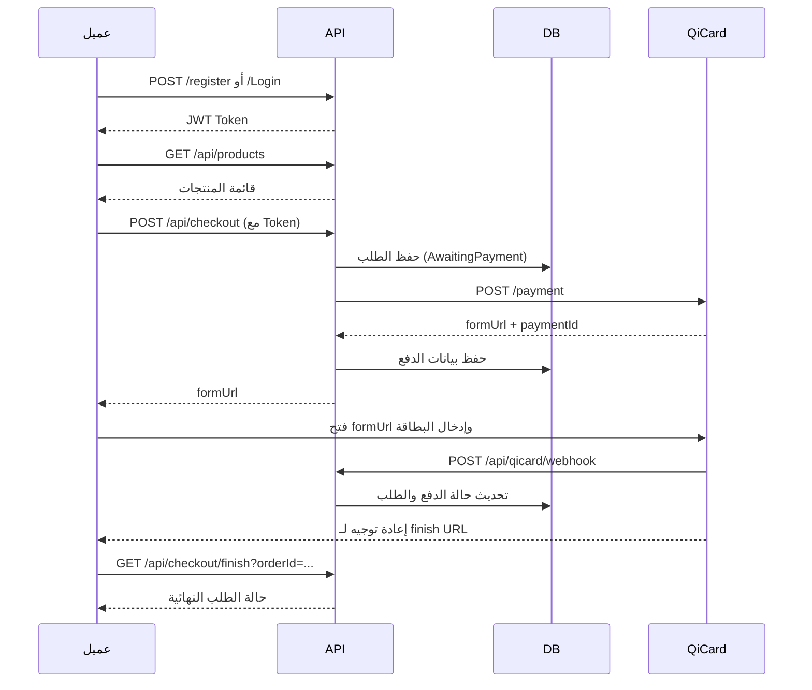

# دليل ربط Qi Card (كي كارد) — من الألف للياء

دليل عربي كامل لربط بوابة الدفع الإلكتروني **Qi Card** مع أي نظام ASP.NET Core، باستخدام المشروع الحالي كنموذج جاهز.

---

## جدول المحتويات

1. [نظرة عامة](#1-نظرة-عامة)
2. [متطلبات التشغيل](#2-متطلبات-التشغيل)
3. [هيكل المشروع](#3-هيكل-المشروع)
4. [الإعداد الأولي](#4-الإعداد-الأولي)
5. [سيناريو الدفع الكامل](#5-سيناريو-الدفع-الكامل)
6. [شرح الـ API خطوة بخطوة](#6-شرح-الـ-api-خطوة-بخطوة)
7. [Webhook وصفحة الإنهاء](#7-webhook-وصفحة-الإنهاء)
8. [نقل الكود لنظام آخر](#8-نقل-الكود-لنظام-آخر)
9. [حالات الدفع](#9-حالات-الدفع)
10. [استكشاف الأخطاء](#10-استكشاف-الأخطاء)

---

## 1. نظرة عامة

### ماذا يفعل النظام؟

```
العميل يسجّل → يختار منتجات → ينشئ طلب → يبدأ دفع Qi Card → يدخل بيانات البطاقة → يُحدَّث الطلب تلقائياً
```

### مخطط التدفق



---

## 2. متطلبات التشغيل

| المتطلب | الوصف |
|---------|--------|
| .NET 10 | إطار العمل |
| SQL Server | قاعدة البيانات |
| Redis | اختياري (للتخزين المؤقت) |
| حساب Qi Card Sandbox | TerminalId + Basic Auth |
| ngrok (للتطوير) | لجعل Webhook متاحاً من الإنترنت |

### بيانات Sandbox (من appsettings.json)

```json
"QiCard": {
  "BaseUrl": "https://uat-sandbox-3ds-api.qi.iq/api/v1/",
  "TerminalId": "237984",
  "BasicAuthUser": "paymentgatewaytest",
  "BasicAuthPassword": "WHaNFE5C3qlChqNbAzH4"
}
```

---

## 3. هيكل المشروع

### المجلد القابل لإعادة الاستخدام (انسخه لأي مشروع)

```
Integration/QiCard/
├── IQiCardService.cs          ← الواجهة (جميع endpoints الـ Postman)
├── QiCardService.cs           ← التنفيذ الكامل
├── QiCardOptions.cs           ← الإعدادات
├── QiCardServiceExtensions.cs ← تسجيل DI: AddQiCardPayment()
└── Dtos/                      ← نماذج الطلب والاستجابة
```

### طبقة سيناريو الشراء

```
Service/
├── IPaymentFlowService.cs     ← واجهة التدفق الكامل
└── PaymentFlowService.cs      ← طلب → Qi Card → تحديث DB

Controller/
├── AuthController.cs          ← تسجيل / دخول
├── ProductsController.cs      ← عرض المنتجات
├── CheckoutController.cs      ← شراء + إنهاء
├── QiCardWebhookController.cs ← استقبال إشعار Qi
└── QiCardAdminController.cs   ← استعلام / إلغاء / استرداد
```

### نموذج الطلب `Orders`

```csharp
public class Orders
{
    public int Id { get; set; }
    public string UserId { get; set; }      // معرّف المستخدم من Identity
    public decimal TotalAmount { get; set; }
    public string Status { get; set; }      // Pending | AwaitingPayment | Paid | Failed
    public ICollection<OrderItems> Items { get; set; }
    public ICollection<Payments> Payments { get; set; }
}
```

---

## 4. الإعداد الأولي

### الخطوة 1: تشغيل قاعدة البيانات

```powershell
cd c:\Users\user\QCardPayment
dotnet ef database update
```

> إذا ظهر خطأ بسبب تغيير `UserId` من `int` إلى `string`، أنشئ migration جديد:
> ```powershell
> dotnet ef migrations add AddProductsAndOrderItems
> dotnet ef database update
> ```

### الخطوة 2: ضبط appsettings.json

```json
"QiCard": {
  "BaseUrl": "https://uat-sandbox-3ds-api.qi.iq/api/v1/",
  "TerminalId": "YOUR_TERMINAL_ID",
  "BasicAuthUser": "YOUR_USER",
  "BasicAuthPassword": "YOUR_PASSWORD",
  "Currency": "IQD",
  "Locale": "ar_IQ",
  "FinishPaymentUrl": "http://localhost:5229/api/checkout/finish",
  "NotificationUrl": "https://YOUR-NGROK-URL/api/qicard/webhook",
  "UseMock": false
}
```

| الإعداد | الغرض |
|---------|-------|
| `FinishPaymentUrl` | يُعاد توجيه العميل هنا بعد الدفع |
| `NotificationUrl` | Qi Card ترسل POST هنا عند اكتمال الدفع |
| `UseMock` | `true` = تجربة بدون اتصال حقيقي بـ Qi |

### الخطوة 3: Webhook محلياً عبر ngrok

```powershell
ngrok http 5229
```

انسخ الرابط (مثل `https://abc123.ngrok.io`) وضعه في `NotificationUrl`:

```
https://abc123.ngrok.io/api/qicard/webhook
```

### الخطوة 4: تشغيل المشروع

```powershell
dotnet run
```

افتح Swagger: `http://localhost:5229/swagger`

---

## 5. سيناريو الدفع الكامل

### الخطوة 1 — تسجيل عميل جديد

```http
POST http://localhost:5229/register
Content-Type: application/json

{
  "username": "ahmed",
  "phoneNumber": "07701234567",
  "password": "123456"
}
```

### الخطوة 2 — تسجيل الدخول والحصول على Token

```http
POST http://localhost:5229/Login
Content-Type: application/json

{
  "phoneNumber": "07701234567",
  "password": "123456"
}
```

**الاستجابة:**
```json
{
  "isSuccess": true,
  "token": "eyJhbGciOiJIUzI1NiIs...",
  "phoneNumber": "07701234567",
  "userName": "ahmed"
}
```

احفظ `token` — ستستخدمه في كل الطلبات التالية.

### الخطوة 3 — عرض المنتجات

```http
GET http://localhost:5229/api/products
```

**الاستجابة (منتجات تجريبية تُضاف تلقائياً):**
```json
[
  { "id": 1, "name": "هاتف ذكي", "price": 350000 },
  { "id": 2, "name": "سماعات لاسلكية", "price": 45000 },
  { "id": 3, "name": "شاحن سريع", "price": 25000 }
]
```

### الخطوة 4 — إتمام الشراء وبدء الدفع

```http
POST http://localhost:5229/api/checkout
Authorization: Bearer {TOKEN}
Content-Type: application/json

{
  "items": [
    { "productId": 1, "quantity": 1 },
    { "productId": 2, "quantity": 2 }
  ]
}
```

**الاستجابة:**
```json
{
  "orderId": 1,
  "paymentId": 1,
  "requestId": "a1b2c3d4-...",
  "qiCardPaymentId": "f2bb43a8-...",
  "amount": 440000,
  "status": "CREATED",
  "formUrl": "https://uat-sandbox-3ds-api.qi.iq/api/v1/payment/f2bb43a8-..."
}
```

### الخطوة 5 — توجيه العميل لصفحة الدفع

افتح `formUrl` في المتصفح. العميل يُدخل بيانات البطاقة في صفحة Qi Card.

> في Sandbox استخدم بطاقات الاختبار التي تُزوّدك بها Qi.

### الخطوة 6 — ما يحدث تلقائياً

1. **Qi Card** ترسل `POST` إلى `/api/qicard/webhook` بحالة الدفع
2. النظام يُحدّث `Payments.Status` و `Orders.Status`
3. **Qi Card** تعيد توجيه العميل إلى `FinishPaymentUrl`

### الخطوة 7 — التحقق من نتيجة الدفع

```http
GET http://localhost:5229/api/checkout/finish?orderId=1
```

**استجابة ناجحة:**
```json
{
  "message": "تمت معالجة الدفع. راجع حالة الطلب أدناه.",
  "orderId": 1,
  "orderStatus": "Paid",
  "totalAmount": 440000,
  "payments": [{ "id": 1, "status": "SUCCESS", "amount": 440000 }]
}
```

---

## 6. شرح الـ API خطوة بخطوة

### endpoints المصادقة

| Method | المسار | الوصف | يحتاج Token |
|--------|--------|--------|-------------|
| POST | `/register` | تسجيل حساب | لا |
| POST | `/Login` | تسجيل دخول | لا |

### endpoints المنتجات والشراء

| Method | المسار | الوصف | يحتاج Token |
|--------|--------|--------|-------------|
| GET | `/api/products` | قائمة المنتجات | لا |
| POST | `/api/checkout` | إنشاء طلب + بدء دفع | نعم |
| GET | `/api/checkout/finish` | نتيجة الدفع | لا |

### endpoints Qi Card الإدارية

| Method | المسار | الوصف |
|--------|--------|--------|
| GET | `/api/qicard/status/{paymentId}` | استعلام حالة من Qi |
| GET | `/api/qicard/status/by-request/{requestId}` | استعلام بالـ RequestId |
| POST | `/api/qicard/sync/{localPaymentId}` | مزامنة الحالة مع DB |
| POST | `/api/qicard/cancel/{paymentId}` | إلغاء دفع |
| POST | `/api/qicard/refund/{paymentId}` | استرداد مبلغ |
| POST | `/api/qicard/webhook` | إشعار Qi (لا يحتاج Token) |

### ما يحدث داخل `PaymentFlowService.CheckoutAsync`

```
1. التحقق من المنتجات وحساب المجموع
2. إنشاء Orders بحالة AwaitingPayment
3. إنشاء OrderItems لكل منتج
4. استدعاء Qi Card: POST /payment
5. حفظ Payments في DB
6. إرجاع formUrl للواجهة الأمامية
```

---

## 7. Webhook وصفحة الإنهاء

### Webhook (`NotificationUrl`)

- Qi Card ترسل `POST` عند الحالات النهائية: `SUCCESS`، `FAILED`، `AUTHENTICATION_FAILED`
- يجب الرد بـ **HTTP 200** وإلا ستعيد المحاولة
- الكود في: `Controller/QiCardWebhookController.cs`

```csharp
[HttpPost("webhook")]
[AllowAnonymous]
public async Task<IActionResult> Webhook([FromBody] QiCardPaymentResponse notification)
{
    await _paymentFlowService.HandleWebhookAsync(notification);
    return Ok(); // مهم جداً
}
```

### Finish URL (`FinishPaymentUrl`)

- Qi Card تعيد توجيه المتصفح هنا بعد الدفع
- الكود في: `Controller/CheckoutController.cs` → `GET finish`
- يُزامن الحالة من Qi ثم يعرض النتيجة

---

## 8. نقل الكود لنظام آخر

### الخطوات (5 دقائق)

**1. انسخ المجلد:**
```
Integration/QiCard/   → مشروعك الجديد
```

**2. أضف في Program.cs:**
```csharp
using QCardPayment.Integration.QiCard;

builder.Services.AddQiCardPayment(builder.Configuration);
```

**3. أضف في appsettings.json:**
```json
"QiCard": {
  "BaseUrl": "...",
  "TerminalId": "...",
  "BasicAuthUser": "...",
  "BasicAuthPassword": "...",
  "Currency": "IQD",
  "FinishPaymentUrl": "https://yoursite.com/payment/finish",
  "NotificationUrl": "https://yoursite.com/api/qicard/webhook"
}
```

**4. استخدم الخدمة مباشرة:**
```csharp
public class MyOrderService
{
    private readonly IQiCardService _qiCard;

    public async Task<string> PayAsync(decimal amount, int orderId)
    {
        var response = await _qiCard.CreatePaymentAsync(new QiCardCreatePaymentRequest
        {
            RequestId = Guid.NewGuid().ToString(),
            Amount = amount,
            Currency = "IQD",
            FinishPaymentUrl = "https://yoursite.com/finish?order=" + orderId,
            NotificationUrl = "https://yoursite.com/api/qicard/webhook"
        });

        return response.FormUrl; // وجّه العميل هنا
    }
}
```

**5. (اختياري) انسخ أيضاً:**
- `Service/PaymentFlowService.cs` — إن أردت سيناريو كامل جاهز
- `Controller/QiCardWebhookController.cs` — لاستقبال الإشعارات

---

## 9. حالات الدفع

### حالات Qi Card

| الحالة | المعنى |
|--------|--------|
| `CREATED` | تم إنشاء الدفع |
| `FORM_SHOWED` | العميل فتح صفحة الدفع |
| `AUTHENTICATION_REQUIRED` | يحتاج 3DS |
| `PROCESSING` | قيد المعالجة |
| `SUCCESS` | نجح الدفع |
| `FAILED` | فشل الدفع |
| `AUTHENTICATION_FAILED` | فشل التحقق 3DS |

### حالات الطلب في نظامنا

| الحالة | المعنى |
|--------|--------|
| `AwaitingPayment` | بانتظار الدفع |
| `Paid` | تم الدفع بنجاح |
| `Failed` | فشل الدفع |
| `Cancelled` | ملغي |

---

## 10. استكشاف الأخطاء

| المشكلة | الحل |
|---------|------|
| `401` من Qi Card | تحقق من `BasicAuthUser` و `BasicAuthPassword` و `X-Terminal-Id` |
| Webhook لا يصل | استخدم ngrok وحدّث `NotificationUrl` |
| الطلب يبقى `AwaitingPayment` | استدعِ `POST /api/qicard/sync/{paymentId}` يدوياً |
| `Order not found` عند checkout | تأكد من Token صالح |
| خطأ DB عند التشغيل | نفّذ `dotnet ef database update` |
| تجربة بدون Qi | ضع `"UseMock": true` في appsettings |

### اختبار Webhook يدوياً

```http
POST http://localhost:5229/api/qicard/webhook
Content-Type: application/json

{
  "requestId": "REQUEST_ID_FROM_CHECKOUT",
  "paymentId": "PAYMENT_ID_FROM_CHECKOUT",
  "status": "SUCCESS",
  "amount": 440000,
  "currency": "IQD"
}
```

---

## ملخص سريع

```
1. dotnet ef database update
2. dotnet run
3. POST /register  →  POST /Login  →  احفظ Token
4. GET  /api/products
5. POST /api/checkout  (Bearer Token)  →  احفظ formUrl
6. افتح formUrl في المتصفح
7. GET /api/checkout/finish?orderId=X  →  تحقق من Paid
```

---

*المشروع مبني على Postman Collection الرسمي لـ Qi Card API v1 — جميع endpoints مغطاة في `Integration/QiCard/QiCardService.cs`*
